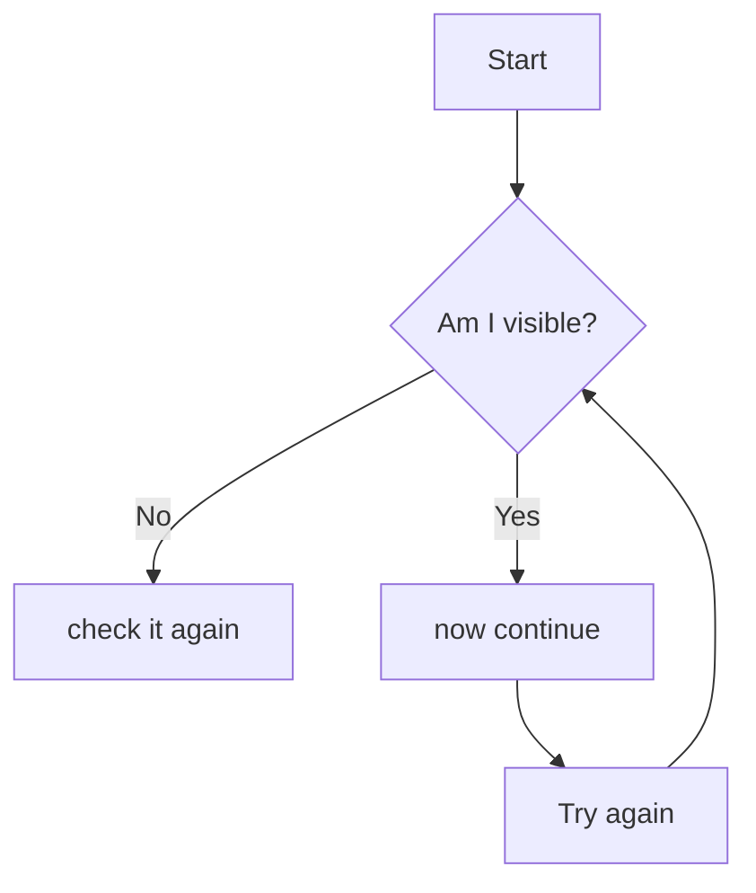

# Workshop 6 
___________________________________

# Making diagrams and flowcharts with the mermaid 
___________________________________

Mermaid is a powerful tool for creating diagrams and flowcharts using a simple markdown-like syntax. 
Mermaid diagrams are supported natively on several platforms which means you can directly use mermaid Syntex without additional extensions.Some of the key platforms include:-

## GitHub:
It supports mermaid diagrams in markdown files (.md) and in issues, pull requests and comments.

## Visual studio code (VS CODE)
With "Markdown Preview Mermaid Support" extension, you can view mermaid diagrams in VS Code.

Other platforms are :- GitLab, Obsidian, Joplin, Notion, etc.
_____________________________________
_____________________________________

### Basic Syntax
____________________________________

Mermaid uses a straightforward syntax to define different types of diagrams. Below are some examples:
____________________________________

#### Flowchart 
____________________________________

____________________________________
