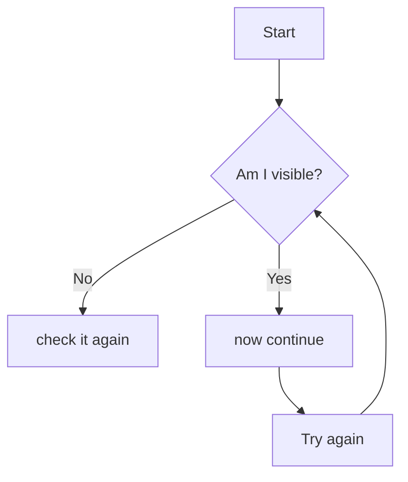

# Workshop 6 
___________________________________

# Making diagrams and flowcharts with the mermaid 
___________________________________

Mermaid is a powerful tool for creating diagrams and flowcharts using a simple markdown-like syntax. It can be embedded in various platforms, including GitHub, GitLab, and other markdown-rendering platforms. Here's a basic overview and some examples to get you started:
___________________________________

### Basic Syntax
____________________________________

Mermaid uses a straightforward syntax to define different types of diagrams. Below are some examples:
____________________________________

#### Flowchart 
____________________________________

____________________________________
