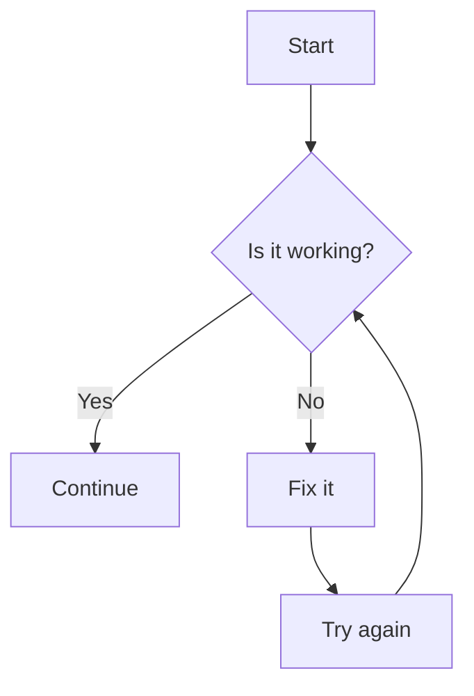
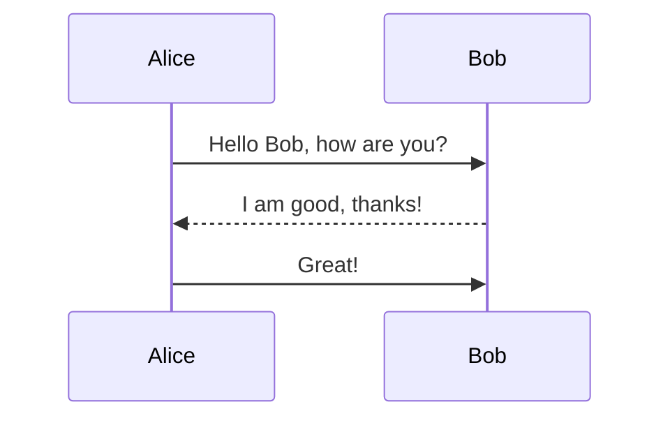
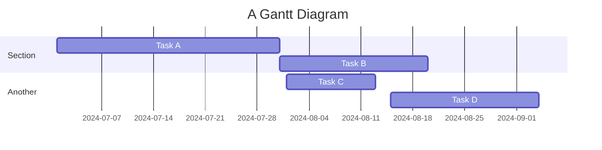
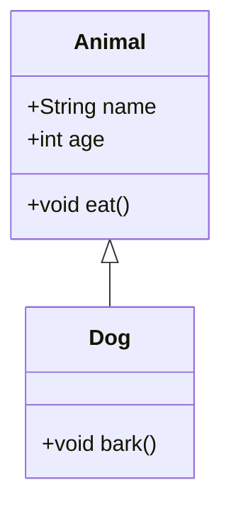

# Workshop 6 
___________________________________

# Making diagrams and flowcharts with the mermaid 
___________________________________

Mermaid is a powerful tool for creating diagrams and flowcharts using a simple markdown-like syntax. It can be embedded in various platforms, including GitHub, GitLab, and other markdown-rendering platforms. Here's a basic overview and some examples to get you started:
___________________________________

### Basic Syntax
___________________________________

Mermaid uses a straightforward syntax to define different types of diagrams. Below are some examples:
___________________________________

#### Flowchart
___________________________________


___________________________________

#### Sequence Diagram
___________________________________


___________________________________

#### Gantt Chart
___________________________________


___________________________________

#### Class Diagram
___________________________________


___________________________________

### Usage
___________________________________

1. **GitHub/GitLab:** Mermaid diagrams can be used directly in markdown files on GitHub and GitLab. Just wrap your mermaid code block with triple backticks and specify `mermaid` as the language.
   
2. **VS Code:** There are extensions available for Visual Studio Code that support Mermaid, allowing you to preview your diagrams as you write them.

3. **Online Editors:** Websites like [Mermaid Live Editor](https://mermaid-js.github.io/mermaid-live-editor/) let you write and preview Mermaid diagrams without any setup.

4. **HTML Integration:** Mermaid can be included in HTML pages. You'll need to include the Mermaid script and initialize it. For example:

    ```html
    <!DOCTYPE html>
    <html>
    <head>
      <script type="module">
        import mermaid from 'https://cdn.jsdelivr.net/npm/mermaid@10/dist/mermaid.esm.min.mjs';
        mermaid.initialize({ startOnLoad: true });
      </script>
    </head>
    <body>
      <div class="mermaid">
      graph TD
          A[Start] --> B{Is it working?}
          B -->|Yes| C[Continue]
          B -->|No| D[Fix it]
          D --> E[Try again]
          E --> B
      </div>
    </body>
    </html>
    ```
___________________________________

### Additional Resources
___________________________________

- **Official Documentation:** [Mermaid GitHub Repository](https://github.com/mermaid-js/mermaid)
- **Live Editor:** [Mermaid Live Editor](https://mermaid-js.github.io/mermaid-live-editor/)
___________________________________
